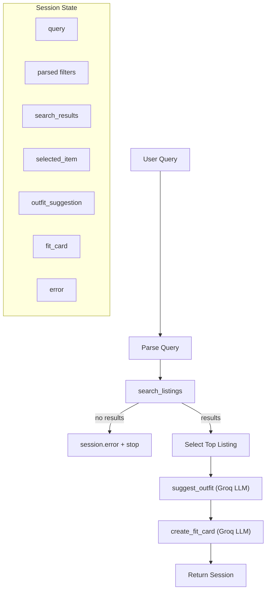

# FitFindr — planning.md

> Complete this document before writing any implementation code.
> Your spec and agent diagram are what you'll use to direct AI tools (Claude, Copilot, etc.) to generate your implementation — the more specific they are, the more useful the generated code will be.
> Your planning.md will be reviewed as part of your submission.
> Update it before starting any stretch features.

---

## Tools

List every tool your agent will use. For each tool, fill in all four fields.
You must have at least 3 tools. The three required tools are listed — add any additional tools below them.

### Tool 1: search_listings

**What it does:**
Searches the FitFindr listings dataset and returns items that match a user query using structured filters (size, price) and keyword relevance scoring over descriptions and style tags.

**Input parameters:**
<!-- List each parameter, its type, and what it represents -->
- `description` (str): natural language description of what the user is looking for (e.g. "vintage graphic tee")
- `size` (str): target clothing size filter (e.g. "M", "W30", "S/M")
- `max_price` (float): maximum price the user is willing to pay

**What it returns:**
A list of listing dictionaries, each containing:
id, title, description, category, style_tags, size, condition, price, colors, brand, platform

**What happens if it fails or returns nothing:**
Returns an empty list. The agent must immediately stop execution, set session["error"], and NOT call downstream tools.

---

### Tool 2: suggest_outfit

**What it does:**
Uses an LLM (Groq client) to generate outfit recommendations that combine a selected thrifted item with the user’s wardrobe items or general styling knowledge.

**Input parameters:**
<!-- List each parameter, its type, and what it represents -->
- `new_item` selected listing from search results
- `wardrobe` (dict): user wardrobe with structure { "items": [...] }

**What it returns:**
A natural language string describing 1–2 outfit combinations, including styling logic, aesthetic direction, and pairing suggestions.

**What happens if it fails or returns nothing:**
If wardrobe is empty → fallback to general styling advice using LLM (no wardrobe-specific references).
If LLM call fails → return a safe fallback string like “Unable to generate outfit suggestion at this time.”

---

### Tool 3: create_fit_card

**What it does:**
Uses an LLM (Groq client) to convert an outfit recommendation into a short, social-media-style caption for sharing a thrifted fit.

**Input parameters:**
<!-- List each parameter, its type, and what it represents -->
- `outfit` (...): outfit description generated by suggest_outfit
- new_item (dict): selected listing
**What it returns:**
A 2–4 sentence stylized caption suitable for Instagram/TikTok/Depop posts.

**What happens if it fails or returns nothing:**
If outfit is empty → return an error-style caption (“No outfit generated — cannot create fit card.”).
If LLM fails → return a fallback caption using only item metadata.

---

## Planning Loop

**How does your agent decide which tool to call next?**
The agent follows a strict sequential pipeline:

Parse the user query into structured fields: description, size, and max_price.
Call search_listings() using parsed filters and retrieve ranked results.
If no results are returned, terminate early and set session["error"].
Select the top-ranked listing as session["selected_item"].
Call suggest_outfit() using the selected item and the full wardrobe (LLM-generated reasoning step).
Pass the outfit output into create_fit_card() to generate a final social caption.
Return the completed session object.

The loop is strictly linear with one early exit condition (empty search results).

---

## State Management

**How does information from one tool get passed to the next?**
The agent uses a single mutable session dictionary created by _new_session() as the sole state container. Each tool reads from and writes to this session sequentially:

parsed stores extracted query filters
search_results stores ranked listings
selected_item stores the chosen listing
outfit_suggestion stores LLM output from suggest_outfit
fit_card stores final LLM-generated caption
error stores termination messages for early exits

State is never recomputed; each step depends only on prior session values.

---

## Error Handling

For each tool, describe the specific failure mode you're handling and what the agent does in response.

| Tool | Failure mode | Agent response |
|------|-------------|----------------|
| search_listings | No results match the query | Set session["error"] and terminate pipeline|
| suggest_outfit | Wardrobe is empty | Call LLM with general styling prompt (no wardrobe dependency)|
| create_fit_card | Outfit input is missing or incomplete | Return fallback caption or error message string|

---

## Architecture

I will use ChatGPT for reasoning, prompt design, and debugging, and Claude for generating initial boilerplate implementations of functions in `tools.py` and `agent.py`.

For each tool implementation, I will:

- Use the function signature and docstring from `tools.py`
- Load and inspect structured data using `load_listings()`
- Design prompts for LLM-based tools that ensure:
  - context-aware outfit generation grounded in wardrobe items
  - concise, social-media-style fit card generation

Each tool will be validated independently before integration.

## Validation strategy

For every tool, I will test:

- 1 standard case (expected valid input)
- 1 edge case (empty wardrobe or no search results)
- 1 boundary case (tight filters like low price or rare size)

Outputs will be verified by checking:

- correctness of returned structure
- handling of missing or empty inputs
- consistency with dataset schema

## Milestone 3 — Individual tool implementations

I will use Claude to generate initial implementations of each function in `tools.py`, guided by:

- function signatures and docstrings
- dataset schema from `load_listings()`
- prompt design instructions for Groq LLM calls

I will then refine outputs using ChatGPT to ensure:

- correct filtering logic in `search_listings`
- robust prompt behavior in `suggest_outfit`
- consistent formatting in `create_fit_card`

Each tool will be tested in isolation using:

- 3 test queries per tool
- at least 1 edge case per tool

## Milestone 4 — Planning loop and state management

I will use Claude to translate the planning loop into `agent.py`, ensuring strict adherence to the session-based state machine defined in `planning.md`.

Inputs provided to the AI:

- full tool specifications
- session state schema
- architecture diagram

The generated implementation will be validated by:

- running CLI tests in `agent.py`
- verifying both:
  - happy path (full pipeline executes end-to-end)
  - failure path (no search results triggers early termination)
- inspecting session dictionary at each step to confirm correct state propagation
---

## A Complete Interaction (Step by Step)

Write out what a full user interaction looks like from start to finish — tool call by tool call. Use a specific example query.

**Example user query:** "I'm looking for a vintage graphic tee under $30. I mostly wear baggy jeans and chunky sneakers. What's out there and how would I style it?"

**Step 1:**
The agent initializes a new session and parses the user query into structured filters:

description: "vintage graphic tee"
max_price: 30
size: None (not explicitly provided)

It then calls the first tool:

search_listings(
    description="vintage graphic tee",
    size=None,
    max_price=30.0
)

**Step 2:**
search_listings() loads all listings via load_listings(), filters by price and relevance, and returns a ranked list of matching items.

The agent selects the top-ranked listing (highest relevance score), for example:

"Graphic Tee — 2003 Tour Bootleg Style"

This selected item is stored in:

session["selected_item"]
**Step 3:**
The agent calls the LLM-based tool:

suggest_outfit(
    new_item=session["selected_item"],
    wardrobe=session["wardrobe"]
)

The LLM generates 1–2 outfit suggestions combining:

the selected vintage graphic tee
wardrobe items such as baggy jeans and chunky sneakers

The response is stored in:

session["outfit_suggestion"]

**Step 4:**
The agent calls the final LLM-based formatting tool:

create_fit_card(
    outfit=session["outfit_suggestion"],
    new_item=session["selected_item"]
)

This produces a 2–4 sentence social-media-style caption describing:

the thrifted item
price + platform
outfit vibe (grunge / 90s streetwear aesthetic)

The result is stored in:

session["fit_card"]

**Final output to user:**
The system returns three UI outputs:

Top listing found:
A formatted version of the selected listing (title, price, platform, condition)
Outfit idea:
LLM-generated styling suggestions combining wardrobe + new item
Your fit card:
A polished caption such as:
“thrifted this faded graphic tee off depop for $24 and paired it with my baggy jeans + chunky sneakers for a full 90s grunge fit 🖤”
